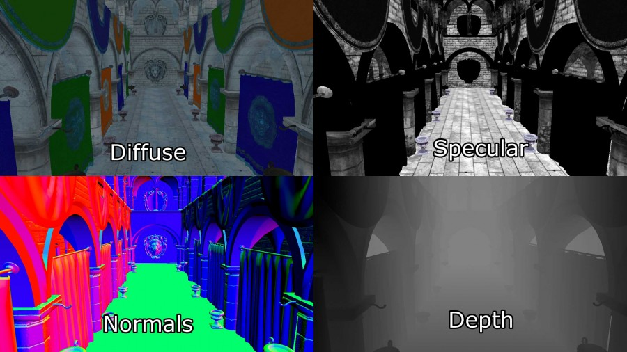

### 介绍
前端渲染通过栅格化场景的多边形对象来工作。通过着色，迭代场景的灯光列表以确定几何对象如何被照亮。这意味着每个集合对象必须关心场景的每个灯光。当然，我们能通过不渲染被遮罩的或者在摄像机视锥之外的几何对象来优化。我们能进一步通过丢弃不摄像机的视锥体里面的光来优化。如果光的范围是已知的，我们也可以在渲染场景几何之前，在光的体积上执行视锥剔除。此技术对象剔除和光体积剔除提供有限的优化，并且当使用前端渲染的时候光剔除更是难以实践。更常见的做法是简单地限制可以影响场景对象的灯光数量。例如，一些图形引擎会对最近的两三个灯光执行逐像素光照，对次近的进行逐顶点光照。传统OpenGL和DirectX固定函数渲染管线的动态光在场景被激活的的数量任何时候都被限制为8个。甚至在现代图形硬件中，如果没有明显的帧率问题，前端渲染会被限制到100个动态场景光源。

延迟渲染，换句话说，是通过栅格化场景对象（没有光照）为一系列的2D图像缓存，用于保存执行后面的光照计算的几何信息。保存为2D图像缓存的有：
-屏幕空间深度
-表面Normal
-diffuse颜色
-specular颜色和次幂

这些二维图像缓冲区的组合称为几何缓冲区(G-Buffer)。

